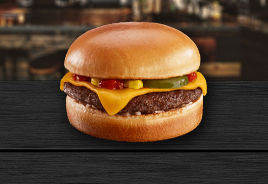

# ЛАБОРАТОРНАЯ НОМЕР 5 (не самая красивая, и не факт что очень рабочая)

# 1. MOBILE FIRST

Получилось подобное ... чудо. Да, это очень базированное "Вкусно и точка" где подают только настоящую, нормальную еду.


Здесь все было сделанно максимально топорно. Первый блок это просто блок без каких либо вмешательств, картинки масштабируются на весь блок при расширении разрешения экрана. Скриншот сделан для 425 пикселей разрешения.

Второй блок сделан через свойство ``colums`` в так называемом CSS файле.

# 2. DESKTOP

Здесь получилось .... повеселее что ли?


Здесь я решил извернуться и сделал это на ``flex`` блоках, как будто я уже очень умный. Здесь я подойду к вам, Владимир Романович, у меня с этим определенные проблемы. А, кстати, тут мы научились тому что такое media-запросы и как их кушать. Вот!

# 3. CODE

Ну и сам код, если вдруг он понадобится.

<details>
    <summary>HTML</summary>

```HTML
<!DOCTYPE html>
<html lang="ru">
<head>
    <link rel="preconnect" href="https://fonts.googleapis.com">
    <link rel="preconnect" href="https://fonts.gstatic.com" crossorigin>
    <link href="https://fonts.googleapis.com/css2?family=Oswald:wght@200&display=swap" rel="stylesheet">
    <meta charset='utf-8'>
    <meta http-equiv='X-UA-Compatible' content='IE=edge'>
    <title>Лабораторная номер №5</title>
    <meta name='viewport' content='width=device-width, initial-scale=1'>
    <link rel='stylesheet' type='text/css' media='screen' href='main.css'>
    <link rel="stylesheet" href="main.css">
    <meta name="viewport" content="width=device-width, initial-scale=1">
    <script src="script.js"></script>

</head>
<body>
    <header>
        <div id="head">
            
        </div>
        <nav>
            <a href="#body">Содержимое</a>
            <a href="https://vkusnoitochka.ru/">Сайт</a>
        </nav>
    </header>
    <div id="promo">    
        <h1>Каталог лабораторной номер 5</h1>
    </div>
    <div class="main-catalog">
        <div class="item">
            
            <p>Чизбургер</p>
        </div>
        <div class="item">
            
            <p>Чизбургер</p>
        </div>
        <div class="item">
            
            <p>Чизбургер</p>
        </div>
        <div class="item">
            
            <p>Чизбургер</p>
        </div>
        <div class="item">
            
            <p>Чизбургер</p></div>
        <div class="item">
            
            <p>Чизбургер</p>
        </div>
    </div>
    <div id="promo">
        <h2>Популярные товары</h2>
    </div>
    <div class="promo-catalog">

        <div class="item">
            
            <p>Чизбургер</p>
        </div>
        <div class="item">
            
            <p>Чизбургер</p>
        </div>
        <div class="item">
            
            <p>Чизбургер</p>
        </div>
        <div class="item">
            
            <p>Чизбургер</p>
        </div>
        <div class="item">
            
            <p>Чизбургер</p>
        </div>
        <div class="item">
            
            <p>Чизбургер</p>
        </div>
        <div class="item">
            
            <p>Чизбургер</p>
        </div>
        <div class="item">
            
            <p>Чизбургер</p>
        </div>
        <div class="item">
            
            <p>Чизбургер</p>
        </div>
        <div class="item">
            
            <p>Чизбургер</p>
        </div>
        <div class="item">
            
            <p>Чизбургер</p>
        </div>
        <div class="item">
            
            <p>Чизбургер</p>
        </div>
    </div>
</body>
</html>
```
</details>

<details>
    <summary>CSS</summary>

```shell
html, body{
    height: 100%;
    padding: 0;
    margin: 0;
    background-color: #FFF7EF;
}

nav{
    margin: 12px;
}

p{
    margin: 0;
}

a:hover{
    text-decoration: none;
}

#promo{
    text-align: center;
}

#head{
    height: 110px;
    text-align: center;
    margin: 15px;
    padding: 10px;
}

#logo{
    height: 100px;
    width: 125px;
}

h1, h2{
    font-family: sans-serif;
}

.item{
    margin-bottom: 10px;
    text-align: left;
    font-size: 25px;
    text-transform: uppercase;
    font-family: 'Oswald', sans-serif;
}

.item:hover .image{
    opacity: 0.6;
    transition: 0.9s;
}

.image{
    width: 100%;
    height: 100%;
    margin-bottom: 0px;
    margin-top: 0px;
    object-fit: cover;
}

.main-catalog{
    text-align: center;
    align-items: center;
    padding-left: 12px;
    padding-right: 12px;
    margin-top: 20px;
    margin-bottom: 20px;
}

.promo-catalog{
    align-items: center;
    padding-left: 12px;
    padding-right: 12px;
    columns: 2 auto;
}

@media (min-width: 1280px) {
    #promo{
        text-align: left;
        margin-left: 50px;
        font-size: 30px;
    }

    .main-catalog{
        display: flex;
        flex-wrap: wrap;
        justify-content: space-between;
        margin-left: 40px;
        margin-right: 40px;
    }

    .promo-catalog{
        align-items: center;
        padding-left: 10px;
        padding-right: 10px;
        columns: 4 auto;
        margin-left: 40px;
        margin-right: 40px;
    }

    .item{
        margin-bottom: 50px;
        text-align: left;
        font-size: 30px;
        text-transform: uppercase;
        font-family: 'Oswald', sans-serif;
    }

    .image{
        margin-bottom: 5px;
    }

    header{
        display: flex;
        flex-wrap: wrap;
        justify-content: space-between;
    }

    #head{
        height: 110px;
        text-align: left;
        margin: 40px;
        margin-bottom: 20px;
        padding: 10px;
    }

    nav{
        display: flex;
        margin-left: 40px;
        margin-right: 40px;
        height: 110px;
        width: 140px;
        text-align: center;
        align-items: center;
        justify-content: center;
        justify-content: space-between;
    }

}
```
</details>