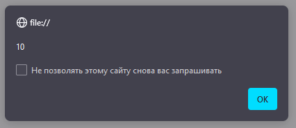
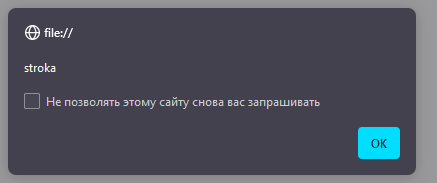
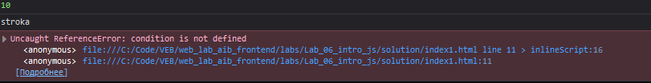
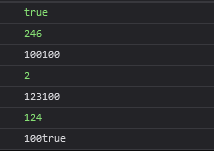
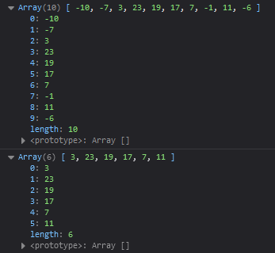
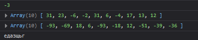
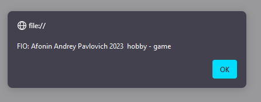
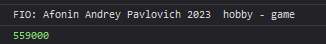

# Лабораторная работа 6

# Задание №1. базовые понятия

```<!DOCTYPE html>
<html lang="ru">
<head>
    <meta charset="UTF-8"/>
    <meta name="viewport" content="width=device-width, initial-scale=1.0"/>
    <title>JS</title>
</head>
<body>
<script>
    let apple = 10;
    alert(apple);
    console.log(apple);
    let conditions = "stroka";
    alert(conditions);
    console.log(conditions);
    console.log('Good game is ' + condition);
</script>
</body>
</html>
```





## Ответы


1. Через какой оператор Вы объявили переменую?

* Через оператор `let`

2. Какие доступны операторы для объявления переменных? В чём их отличия?

* Операторы для объявления переменных в JavaScript:

    * var: 
    * let: 
    * const: 
* Основное отличие между `let` и `const` заключается в том, что переменные, объявленные с помощью `let`, могут изменять свои значения, в то время как переменные, объявленные с помощью `const`, остаются неизменными после присвоения значения.

3. Что происходит при вызове `alert()`?

* При вызове `alert()` отображается модальное окно с сообщением, переданным в функцию. В данном случае, `alert(apple)` отобразит окно с содержанием переменной apple.

4. Как Вы думаете для чего может использоваться `console.log()`

* `console.log()` используется для вывода информации в консоль разработчика браузера. 

# Задание 2. Магия конкатенации

```<!DOCTYPE html>
<html lang="ru">
<head>
    <meta charset="UTF-8"/>
    <meta name="viewport" content="width=device-width, initial-scale=1.0"/>
    <title>JS</title>
</head>
<body>
<script>
    let apple = 123,
        sliva = '100',
        cherry = true;
    console.log(apple);
    console.log(sliva);
    console.log(cherry);
    console.log(apple + apple);
    console.log(sliva + sliva);
    console.log(cherry + cherry);
    console.log(apple + sliva);
    console.log(apple + cherry);
    console.log(sliva + cherry);
</script>
</body>
</html>
```


# Задание 3. работа с массивами

```
<!DOCTYPE html>
<html lang="ru">
<head>
    <meta charset="UTF-8"/>
    <meta name="viewport" content="width=device-width, initial-scale=1.0"/>
    <title>JS</title>
</head>
<body>
<script>
let array = []
for (let i=0; i<10; i++)
    array.push(Math.floor( -15 + 50 * Math.random()));
console.log(array);
array = array.filter(num => num >= 0);
console.log(array);
</script>
</body>
</html>
```



# Задание 4. Работа с функциями

```<!DOCTYPE html>
<html lang="ru">
<head>
    <meta charset="UTF-8"/>
    <meta name="viewport" content="width=device-width, initial-scale=1.0"/>
    <title>JS</title>
</head>
<body>
<script>

    function getRandomInt(max, min) {
    return Math.floor(min + Math.random() * max);
    }
let pip = getRandomInt(25, -5)
console.log(pip);

let array = []
for (let i=0; i<10; i++)
    array.push(Math.floor( -15 + 50 * Math.random()));
console.log(array);

    function mass2(array, number){
    let new_array = array.map(element => element * number);
    return new_array;
    }

let array2 = mass2(array, pip);
console.log(array2);

let random_word = function() {
  let alphabet = 'йцукенгшщзхъфывапролджэячсмитьбю';
  let word = '';
  for (let i = 0; i < 7; i++) {
    let index = Math.floor(Math.random() * alphabet.length);
    word += alphabet[index];
  }
  return word;
};

console.log(random_word());
</script>
</body>
</html>
```


# Работа с объектами

```<!DOCTYPE html>
<html lang="ru">
<head>
    <meta charset="UTF-8"/>
    <meta name="viewport" content="width=device-width, initial-scale=1.0"/>
    <title>JS</title>
</head>
<body>
<script>
 let obect = {};
    obect.firstName = 'Andrey';
    obect.surname = 'Afonin';
    obect.patronymic = 'Pavlovich';
    obect.birthday = '2003';
    obect.hobby = 'game';
    obect.group = 'АСБ-037';
obect.get_inform = function () {
    let year = this.birthday.substring(6,10);
    let age = 2023 - year;
    let inf = 'FIO: ' + this.surname + ' ' + this.firstName + ' ' + this.patronymic + ' ' + age + ' '  + year + ' hobby - ' + this.hobby;
    return inf;
    }
alert(obect.get_inform());
console.log(obect.get_inform());

let obect2 = {
    "Иван": 50000,
    "Мария": 60000,
    "Александр": 55000,
    "Екатерина": 58000,
    "Дмитрий": 52000,
    "Анна": 63000,
    "Сергей": 54000,
    "Ольга": 57000,
    "Николай": 51000,
    "Елена": 59000
    };
let salary = 0;
for (let key in obect2){
    salary += obect2[key];
    }
console.log(salary);
</script>
</body>
</html>
```


